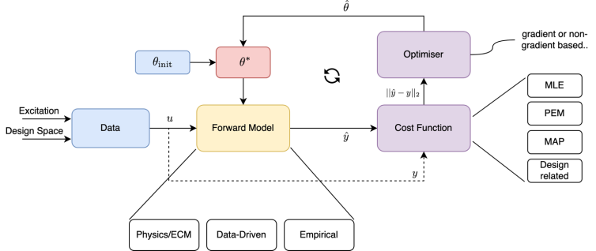

# PyBOP - A *Py*thon package for *B*attery *O*ptimisation and *P*arameterisation

PyBOP aims to be a modular library for the parameterisation and optimisation of battery models, with a particular focus on classes built around [PyBaMM](https://github.com/pybamm-team/PyBaMM) models. The figure below gives the current conceptual idea of PyBOP's structure. This will likely evolve as development progresses.

    

The living software specification of PyBOP can be found here; however, an overview is introduced below.

- Provide both frequentist and bayesian parameterisation and optimisation methods to battery modellers
- Provide workflows and examples for parameter fitting and grouping
- Create diagnostics for end-users to convey parameter and optimisation fidelity

**Community and values**

PyBOP aims to foster a broad consortium of developers and users, building on and
learning from the success of the PyBaMM community. Our values are:

-   Open-Source (code and ideas should be shared)

-   Inclusivity and fairness (those who want to contribute may do so,
    and their input is appropriately recognised)

-   Inter-operability (aiming for modularity to enable maximum impact
    and inclusivity)

-   User-friendliness (putting user requirements first, thinking about user- assistance & workflows)