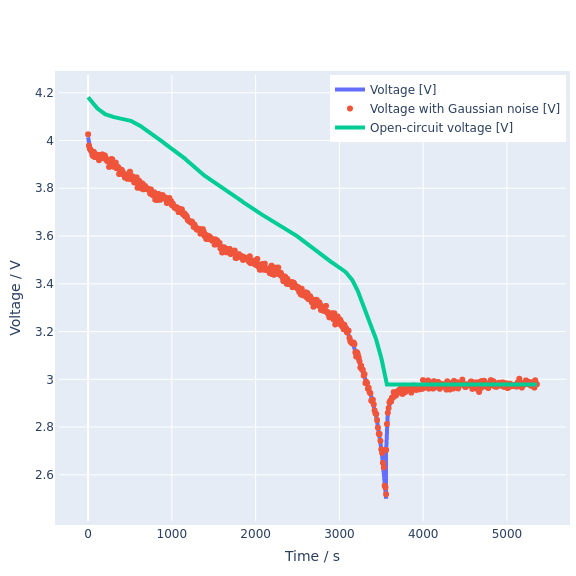
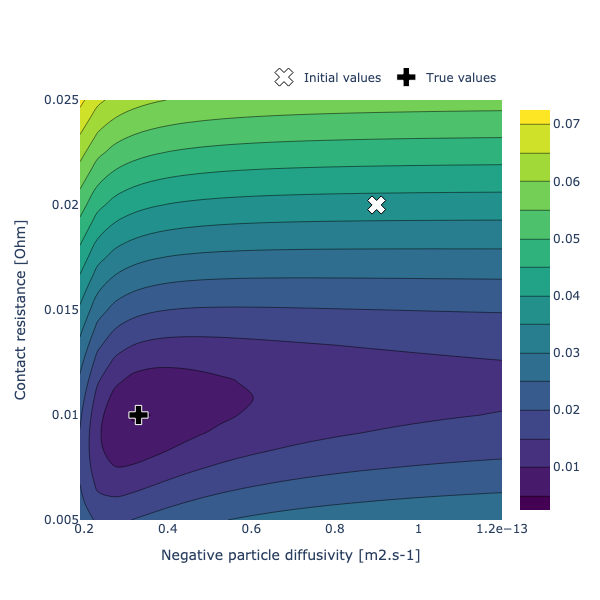
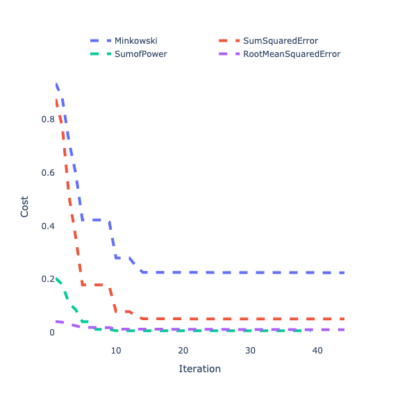
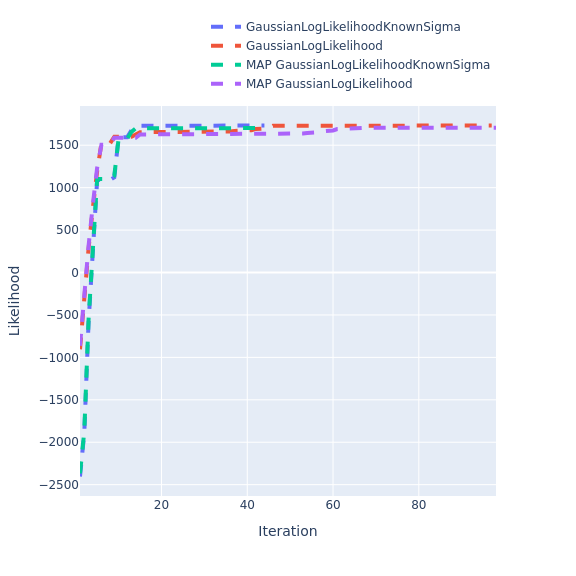
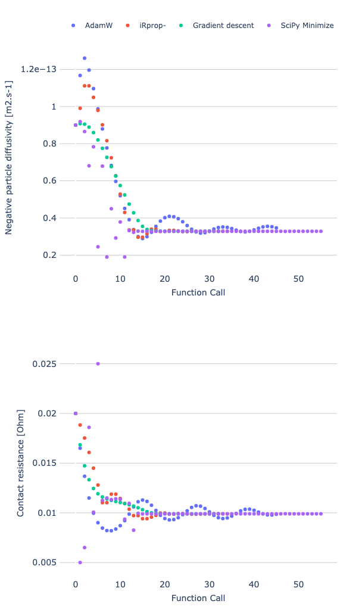
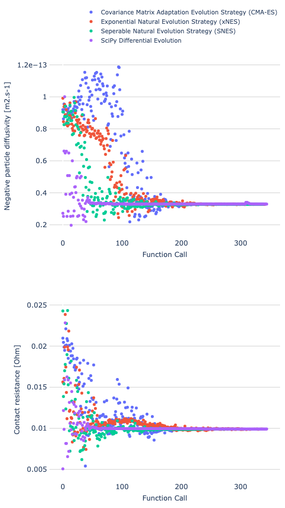
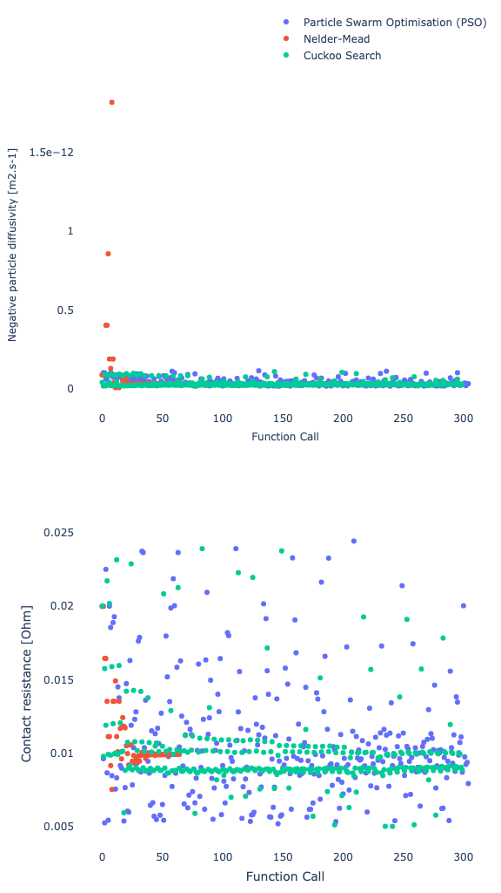
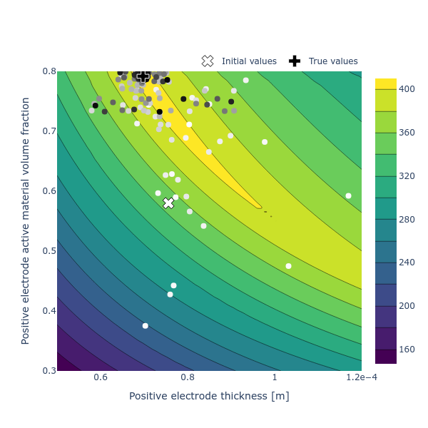
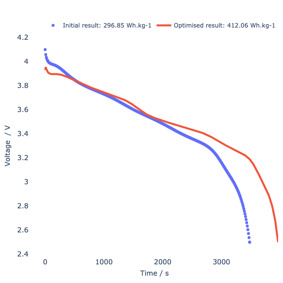

# Summary

The Python Battery Optimisation and Parameterisation (`PyBOP`) package provides a set of methods for the parameterisation and optimisation of battery models, offering both Bayesian and frequentist approaches with example workflows to assist the user. `PyBOP` can be used for parameter identification of various models, including the electrochemical and equivalent circuit models provided by the popular open-source package `PyBaMM` [@Sulzer:2021]. Similarly, `PyBOP` can be used for parameter design optimisation under user-defined operating conditions across a variety of model structures. `PyBOP` enables battery model parameterisation across a range of methods with diagnostics on the performance and convergence of the identified or optimised parameters. The identified parameters can be used for prediction, on-line control and design optimisation, all of which support improved battery utilisation and development.

# Statement of need

`PyBOP` is a Python package designed to provide a user-friendly, object-oriented interface for the optimisation of battery models. `PyBOP` leverages the open-source `PyBaMM` [@Sulzer:2021] package for formulation and solving of these battery models. `PyBOP` is intended to serve a broad audience of students, engineers, and researchers in both academia and the battery industry, by enabling usage of predictive battery models where not previously possible. `PyBOP` prioritises clear and informative diagnostics and workflows for both new and experienced users, while leveraging advanced optimisation algorithms provided by `SciPy` [@SciPy:2020], `PINTS` [@Clerx:2019], and its own internal implementations such as the adaptive moment estimation with weight decay (AdamW), and Cuckoo search.

`PyBOP` supports the Battery Parameter eXchange (BPX) standard [@BPX:2023] for sharing battery parameter sets. As these parameter sets are costly to obtain due to a number of factors: the equipment and time spent on characterisation experiments, the requirement of battery domain knowledge, and the computational cost of parameter estimation. `PyBOP` reduces the barrier to entry and ongoing costs by providing an accessible workflow that efficiently connects battery models with numerical optimisers, as well as explanatory examples of battery parameterisaton and design optimisation.

This package complements other tools in the field of lithium-ion battery modelling built around `PyBaMM`, such as `liionpack` for simulating battery packs [@Tranter2022] as the identified parameters are easily exportable from `PyBOP` into packages aimed at predictive forward modelling.

# Architecture

`PyBOP` is deployed through PyPI under the `pybop` package name, with currently supported Python versions of 3.9 — 3.12. As shown in \autoref{fig:high-level}, `PyBOP` composes the popular battery modelling package `PyBaMM` for forward modelling and provides classes for parameterisation and optimisation. This approach enables a robust object construction process with consistent interfacing between the models and optimisers. `PyBOP` provides statistical methods and optimisation algorithms to interface cleanly with the forward model predictions. Furthermore, identifiability metrics are provided for the estimated parameters through Hessian approximation of the cost and likelihood functions in the frequentist workflows and posterior moments in the Bayesian workflows.

{width=80%}

`PyBOP` formulates the optimisation workflow through four main classes, namely the model, problem (or observer), cost (or likelihood), and optimiser (or sampler), as shown in \autoref{fig:classes}. Each of these objects represent a base class with children classes constructing specialised functionality for parameterisation or optimisation workflows. For example, the model class offers children classes for differing physics-based battery models, as well as empirical models. This allows for the underlying `PyBaMM` model to be constructed and validated for the different requirements between the physics-based and empirical models. For a given set of model equations provided from `PyBaMM`, the initial conditions, spatial discretisation, and numerical solver are constructed. By composing `PyBaMM` models directly into `PyBOP`, the underlying model structure can be modified, and optimally constructed for the optimisation tasks. One such example of this, is the spatial rediscretisation that is performed when geometric parameters are optimised. In this situation, `PyBOP` aims to minimally reconstruct the `PyBaMM` model while maintaining the problem, cost, and optimiser objects, providing improved performance benefits to users. In the typical optimisation workflow, the classes in \autoref{fig:classes} are constructed in sequence. Likewise, `PyBOP` offers parameter inference from electrochemical impedance spectroscopy datasets by discretising the forward model into mass matrix form, converting to the frequency domain, and performing a sparse linear solve as initially presented in [@pybamm-eis:2024]. In this situation, the forward models are constructed within the spatial rediscretisation workflow, allowing for geometric parameter inference from EIS forward model predictions.

{ width=80% }

The currently implemented subclasses for the model, problem, and cost classes are listed in \autoref{tab:subclasses}. The cost functions in \autoref{tab:subclasses} are grouped by problem type, while the model and optimiser classes can be selected in combination with any problem-cost pair.

:List of available model, problem and cost (or likelihood) classes. \label{tab:subclasses}

| Battery Models                      | Problem Types   | Cost / Likelihood Functions    |
| :---------------------------------- | :-------------- | :----------------------------- |
| Single particle model (SPM)         | Fitting problem | Sum squared error              |
| SPM with electrolyte (SPMe)         |                 | Root mean squared error        |
| Doyle-Fuller-Newman (DFN)           |                 | Minkowski                      |
| Many particle model (MPM)           |                 | Sum of power                   |
| Multi-species multi-reaction (MSMR) |                 | Gaussian log likelihood        |
| Weppner Huggins                     |                 | Maximum a posteriori           |
| Equivalent circuit model (ECM)      | Observer        | Unscented Kalman filter        |
|                                     | Design problem  | Gravimetric energy density     |
|                                     |                 | Volumetric energy density      |

Likewise, the current optimisation algorithms available for usage in optimisation tasks are presented in \autoref{tab:optimisers}. From this point onwards, the parameterisation and design optimisation tasks will simply be referred to as optimisation tasks. This simplification can be justified by inspecting \autoref{eqn:parameterisation} and \autoref{eqn:design} and confirming that parameterisation can be viewed as an optimisation task to minimise a distance-based cost function.

: The currently supported optimisation algorithms classified by candidate solution type, inclusive of gradient information. (*) Scipy minimize has gradient and non-gradient methods. \label{tab:optimisers}

| Gradient-based                                       | Evolutionary Strategies               | (Meta)heuristic      |
| :--------------------------------------------------- | :------------------------------------ | :------------------- |
| Adaptive moment estimation with weight decay (AdamW) | Covariance matrix adaptation (CMA-ES) | Particle swarm (PSO) |
| Improved resilient backpropagation (iRProp-)         | Exponential natural (xNES)            | Nelder-Mead          |
| Gradient descent                                     | Separable natural (sNES)              |                      |
| SciPy minimize (*)                                   | SciPy differential evolution          |                      |
|                                                      | Cuckoo search                         |                      |

 As discussed above, `PyBOP` offers Bayesian inference methods such as Maximum a Posteriori (MAP) presented alongside the frequentist methods in \autoref{tab:subclasses}; however, for a full Bayesian framework, Monte Carlo sampling is implemented within `PyBOP`. These methods construct a posterior distribution on the inference parameters which can used for uncertainty and practical identifiability diagnostics. The individual sampler classes are currently composed within `PyBOP` from the `PINTS` library, with a base sampling class implemented for interoperability and direct integration to the `PyBOP` model, problem, and likelihood classes. The currently supported samplers are presented in \autoref{tab:samplers}.

: PyBOP's Monte Carlo sampling methods separated based on candidate suggestion method. \label{tab:samplers}

| Hamiltonian-based | Adaptive                   | Slice Sampling       | Evolutionary           | Other                        |
| :---------------- | :------------------------- | :------------------- | :--------------------- | :--------------------------- |
| Monomial Gamma    | Delayed Rejection Adaptive | Slice Doubling       | Differential Evolution | Metropolis Random Walk       |
| No-U-Turn         | Haario Bardenet            | Slice Rank Shrinking |                        | Emcee Hammer                 |
| Hamiltonian       | Rao Blackwell              | Slice Stepout        |                        |                              |
| Relativistic      | Haario                     |                      |                        | Metropolis Adjusted Langevin |

# Background

## Battery models

In general, battery models can be written in the form of a differential-algebraic system of equations:
\begin{equation}
\frac{\mathrm{d} \mathbf{x}}{\mathrm{d} t} = f(t,\mathbf{x},\mathbf{y},\mathbf{u}(t),\mathbf{\theta}),
\label{dynamics}
\end{equation}
\begin{equation}
\mathbf{y}(t) = g(t,\mathbf{x},\mathbf{y},\mathbf{u}(t),\mathbf{\theta}),
\label{output}
\end{equation}
with initial conditions
\begin{equation}
\mathbf{x}(0) = \mathbf{x}_0(\mathbf{\theta}).
\label{initial_conditions}
\end{equation}

Here, $t$ is time, $\mathbf{x}(t)$ are the (spatially discretised) states, $\mathbf{y}(t)$ are the outputs (for example the terminal voltage), $\mathbf{u}(t)$ are the inputs (e.g. the applied current) and $\mathbf{\theta}$ are the unknown parameters.

Common battery models include various types of equivalent circuit models (e.g. the Thévenin model), the Doyle–Fuller–Newman (DFN) model [@Doyle:1993; @Fuller:1994] based on porous electrode theory and its reduced-order variants including the single particle model (SPM) [@Planella:2022], as well as the multi-species, multi-reaction (MSMR) model [@Verbrugge:2017].

Simplified models that retain good prediction capabilities at a lower computational cost are widely used, for example within battery management systems, while physics-based models are required to understand the impact of design parameters on battery performance. This separation of complexity conventionally results in multiple parameterisation for a single battery type, dependent on the model structure.

# Examples

## Parameterisation

Battery model parameterisation is challenging due to the high number of parameters needed to identify compared to measurable outputs [@Miguel:2021; @Wang:2022; @Andersson:2022]. A complete parameterisation often requires a step-by-step identification of smaller groups of parameters from a variety of different datasets [@Chu:2019; @Chen:2020; @Kirk:2022] and excitations.

A generic data fitting optimisation problem may be formulated as:
\begin{equation}
\min_{\mathbf{\theta}} ~ \mathcal{L}_{(\mathbf{y}_i)}(\mathbf{\theta}) ~~~
\textrm{subject to equations (\ref{dynamics})\textrm{-}(\ref{initial_conditions})}
\label{eqn:parameterisation}
\end{equation}
in which $\mathcal{L} : \mathbf{\theta} \mapsto [0,\infty)$ is a cost (or likelihood) function that quantifies the agreement between the model and a sequence of observations $(\mathbf{y}_i)$ measured at times $t_i$. For gradient-based optimisers, the Jacobian of the cost function with respect to the unknown parameters, $(\frac{\partial L}{\partial \theta})$ is used as additional information (step size and direction) for the algorithm when exploring the search space.

We next demonstrate the fitting of synthetic data for which we know the true parameter values. In this example problem, we employ `PyBaMM`'s implementation of the single particle model (SPM) with an added contact resistance submodel. We assume that the battery model is already parameterised except for two dynamic parameters, namely the lithium diffusivity in the active material particles in the negative electrode (the "negative particle diffusivity") and the contact resistance. We generate synthetic data of a 1C (the corresponding applied current required to discharge the cell in one hour) discharge for one hour, followed by 30 minutes of relaxation. This data is then corrupted with 2mV gaussian zero mean noise, shown by the dots in \autoref{fig:simulation}. The initial states are assumed known, although such an assumption is not necessary in general. The underlying cost landscape to be explored by the optimiser is shown in \autoref{fig:landscape}.

{ width=40% }
{ width=40% }

In order to identify the best fit parameter values, we can employ any of the error-based cost functions and any of the optimisers. Due to the vastly different magnitudes of the two parameters, we apply two of the transformations offered by `PyBOP`, namely the log transformation for the negative particle diffusivity and the scaled transformation (with a coefficient of 100) for the contact resistance. This application transforms the optimisers search space, enabling a shared step-size between the parameters; however, in general is not required. As a demonstration of `PyBOP`'s parameterisation capabilities, (\autoref{fig:minimising}) shows the rate of convergence for each of the error-minimising cost functions, while (\autoref{fig:maximising}) displays analogous results for maximising a likelihood. Here, the optimisation is performed with SciPy minimize using the gradient-based L-BFGS-B method.

{ width=40% }
{ width=40% }

Furthermonre, we can also compare the performance of the various optimisation algorithms divided by category: gradient-based algorithms in \autoref{fig:gradient}, evolution strategies in \autoref{fig:evolution} and (meta)heuristics in \autoref{fig:heuristic}. Note that the optimiser performance depends on the specific cost landscape, prior information, and corresponding hyperparameters.

{ width=30% }
{ width=30% }
{ width=30% }

## Design optimisation

Design optimisation is supported within `PyBOP` to guide future development of battery design by identifying parameter sensitivities which may unlock improvements in battery performance. This problem can be viewed similarly to the parameterisation workflows described above; however, with the aim of maximising a distance metric instead of minimising it. In the case of design optimisation for maximising gravimetric energy density, `PyBOP` minimises the negative of the cost function, where the cost metric is no longer a distance between two time-series vectors, but instead is the integrated energy from the vector normalised with the corresponding cell mass. This is typically quantified for operational conditions such as a 1C capacity.

Design optimisation can be written in the form of a constrained optimisation problem as:
\begin{equation}
\min_{\mathbf{\theta} \in \Omega} ~ \mathcal{L}(\mathbf{\theta}) ~~~
\textrm{subject to equations (\ref{dynamics})\textrm{-}(\ref{initial_conditions})}
\label{eqn:design}
\end{equation}
in which $\mathcal{L} : \mathbf{\theta} \mapsto [0,\infty)$ is a cost function that quantifies the desirability
of the design and $\Omega$ is the set of allowable parameter values.

As an example, let us consider the target of maximising gravimetric energy density subject to constraints on two of the geometric electrode parameters [@Couto:2023]. For this example, we use `PyBaMM`'s implementation of the single particle model with electrolyte (SPMe) to investigate the impact of the positive electrode thickness and active material volume fraction on the target cost. The energy density is typically computed from a constant-current discharge performed at an appropriate rate. Here, we estimate the 1C rate (the current required to fully discharge a battery in one hour) from the theoretical capacity for each iteration of the design.

{ width=40% }
{ width=40% }

\autoref{fig:gravimetric} shows the optimiser's search for the maximum gravimetric energy density within the parameter space. For this example, we employ the particle swarm optimisation (PSO) algorithm from `PINTS`. The predicted improvement in the discharge profile between the initial and optimised parameter values is shown in \autoref{fig:prediction}.

# Acknowledgements

We gratefully acknowledge all [contributors](https://github.com/pybop-team/PyBOP?tab=readme-ov-file#contributors-) to this package. This work was supported by the Faraday Institution Multiscale Modelling (MSM) project (ref. FIRG059), UKRI's Horizon Europe Guarantee (ref. 10038031), and EU IntelLiGent project (ref. 101069765).

# Discussion Points
- Performance (multiprocessing)
- ~~Construction of PyBaMM models (geometric and non-geometric identification)~~
- Feasibility checks on identified parameters
- Samplers + EIS methods
- Spatial identification methods?
- Documentation supported at https://pybop-docs.readthedocs.io/en/latest/
- Benchmarks provided at https://pybop-team.github.io/pybop-bench/
- Plotting classes via Plotly (cost landscapes, gradient landscapes)
- Test suite provided by pytest (~99% coverage)
- Standalone implementations (Bring your own model)

# References
