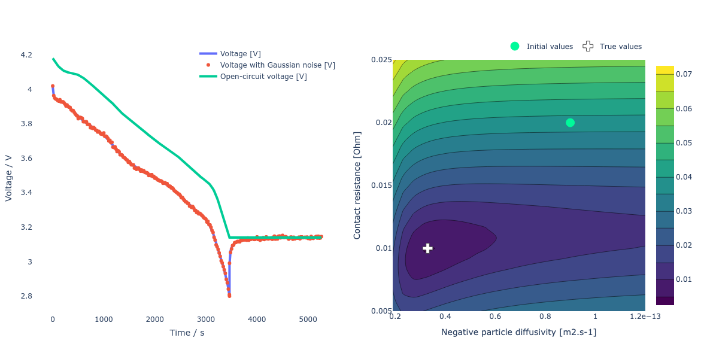
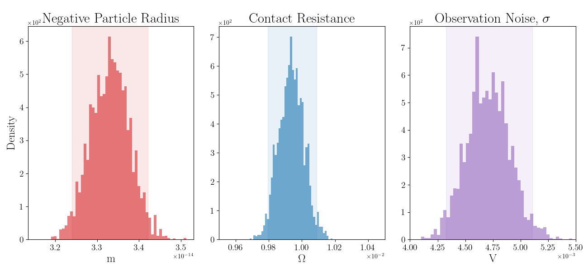
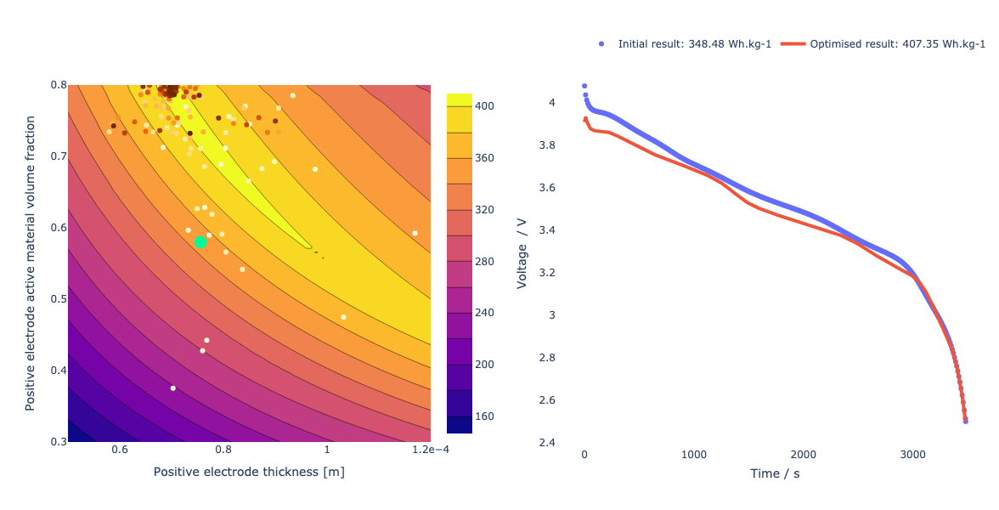

# Summary

The Python Battery Optimisation and Parameterisation (`PyBOP`) package provides a set of methods for the parameterisation and optimisation of battery models, offering both Bayesian and frequentist approaches with example workflows to assist the user. `PyBOP` has been developed to enable parameter identification of various battery models, including the electrochemical and equivalent circuit models provided by the popular open-source `PyBaMM` package [@Sulzer:2021].

Similarly, `PyBOP` can be used for parameter design optimisation under user-defined operating conditions across a variety of model structures. `PyBOP` allows battery model parameterisation using a range of methods with diagnostics on the performance and convergence of the identified or optimised parameters. The identified parameters can be used for prediction, on-line control and design optimisation, all of which support improved battery utilisation and development.

# Statement of need

`PyBOP` is a Python package designed to provide a user-friendly, object-oriented interface for optimising battery models. `PyBOP` leverages the open-source `PyBaMM` package [@Sulzer:2021] to formulate and solve of these battery models. `PyBOP` is intended to serve a broad audience of students, engineers, and researchers in both academia and the battery industry by enabling the use of predictive battery models where previously this was not possible. `PyBOP` emphasises clear and informative diagnostics and workflows for users of varying expertise, by providing advanced optimisation and sampling algorithms. These methods are provided through interfaces to `PINTS` [@Clerx:2019], `SciPy` [@SciPy:2020], in addition to the PyBOP's own algorithms such as Adaptive Moment Estimation with Weight Decay (AdamW), and Cuckoo search.

`PyBOP` supports the Battery Parameter eXchange (BPX) standard [@BPX:2023] for sharing battery parameter sets. As these parameter sets are costly to obtain due to: the equipment and time required for characterisation experiments, the need for battery domain knowledge, and the computational cost of parameter estimation. `PyBOP` reduces these costs by providing fast computational estimation with parameter set interoperability.

This package complements other lithium-ion battery modelling packages built around `PyBaMM`, such as `liionpack` for battery pack simulation [@Tranter2022] and `pybamm-eis` for numerical impedance spectroscopy, as the identified parameters from `PyBOP` are easily exportable.

# Architecture

`PyBOP` has a layered data structure designed to compute and process the forward model predictions and to package the necessary information for the optimisation and sampling algorithms. The forward model is solved using the popular battery modelling package, `PyBaMM`, with construction, parameterisation, and discretisation managed by PyBOP's model interface to PyBaMM. This approach provides a robust object construction process with a consistent interface between the models and optimisers. The statistical methods and optimisation algorithms are then constructed to interface cleanly with the forward model predictions. Furthermore, identifiability metrics are provided alongside the estimated parameters through Hessian approximation of the cost functions in the frequentist workflows and posterior moments in the Bayesian workflows.

{width=80%}

`PyBOP` formulates the inference process into four key classes, namely the model, the problem, the cost, and the optimiser/sampler, as shown in \autoref{fig:classes}. Each of these objects represents a base class with child classes constructing specialised functionality for inference or optimisation workflows. The model class constructs a `PyBaMM` forward model for a given set of model equations provided by `PyBaMM`, initial conditions, spatial discretisation, and numerical solver. By composing `PyBaMM` directly into `PyBOP`, specialised models can be constructed alongside the standard models, which can be modified, and optimally constructed for the inference tasks. One such example is spatial rediscretisation, which is performed when geometric parameters are optimised. In this situation, `PyBOP` minimally rediscretises the `PyBaMM` model while maintaining the problem, cost, and optimiser objects, providing improved performance benefits to users. Alongside construction of the forward model, `PyBOP`'s model class provides methods for obtaining sensitivities from the prediction, enabling gradient-based optimisation algorithms. This prediction, along with it's corresponding sensitivities, is provided to the problem class for processing and exception control. A standardised data structure is then provided to the cost classes, providing a distance, design, or likelihood-based metric for optimisation. For deterministic optimisation, the optimisers minimise the corresponding cost function or the negative log-likelihood if a likelihood class is provided. Bayesian inference is provided by Monte Carlo sampling classes, which accept the LogPosterior class and sample from it using Pints' based Monte Carlo algorithms at the time of submission. In the typical workflow, the classes in \autoref{fig:classes} are constructed in sequence.

In addition to the core architecture, `PyBOP` provides several specialised inference and optimisation processes. One such instance is numerical electrochemical impedance spectroscopy predictions by discretising the forward model into sparse mass matrix form with accompanying auto-differentiated Jacobian. These objects are then translated into the frequency domain with a linear solution used to compute the battery model impedance. In this situation, the forward models are constructed within the spatial rediscretisation workflow, allowing for geometric parameter inference from EIS forward model predictions. Furthermore, `PyBOP` builds on the JAX [@jax:2018] numerical solvers provided by `PyBaMM` by providing JAX-based cost functions for automatic forward model differentiation with respect to the parameters. This functionality provides a performance improvement alongside an interface to JAX-based inference packages, such as Numpyro [@numpyro:2019], BlackJAX [@blackjax:2024], and Optax [@optax:2020].

{ width=80% }

The currently implemented subclasses for the model, problem, and cost classes are listed in \autoref{tab:subclasses}. The cost functions are grouped by problem type, while the model and optimiser classes can be selected in combination with any problem-cost pair.

:List of available model, problem and cost (or likelihood) classes. \label{tab:subclasses}

| Battery Models                      | Problem Types   | Cost / Likelihood Functions |
|:------------------------------------|:----------------|:----------------------------|
| Single particle model (SPM)         | Fitting problem | Sum squared error           |
| SPM with electrolyte (SPMe)         |                 | Root mean squared error     |
| Doyle-Fuller-Newman (DFN)           |                 | Minkowski                   |
| Many particle model (MPM)           |                 | Sum of power                |
| Multi-species multi-reaction (MSMR) |                 | Gaussian log likelihood     |
| Weppner Huggins                     |                 | Maximum a posteriori        |
| Equivalent circuit model (ECM)      | Observer        | Unscented Kalman filter     |
|                                     | Design problem  | Gravimetric energy density  |
|                                     |                 | Volumetric energy density   |

Similarly, the current algorithms available for optimisation tasks are presented in \autoref{tab:optimisers}. From now on, the point-based parameterisation and design optimisation tasks will simply be referred to as optimisation tasks. This simplification can be justified by examining \autoref{eqn:parameterisation} and \autoref{eqn:design} and confirming that deterministic parameterisation can be viewed as an optimisation task to minimise a distance-based cost function.

: The currently supported optimisation algorithms classified by candidate solution type, including gradient information. (*) Scipy minimize has gradient and non-gradient methods. \label{tab:optimisers}

| Gradient-based                                    | Evolutionary                          | (Meta)heuristic           |
|:--------------------------------------|:-------------------------------|:------------------------|
| Weight decayed adaptive moment estimation (AdamW) | Covariance matrix adaptation (CMA-ES) | Particle swarm (PSO)      |
| Improved resilient backpropagation (iRProp-)      | Exponential natural (xNES)            | Nelder-Mead               |
| Gradient descent                                  | Separable natural (sNES)              | Cuckoo search             |
| SciPy minimize (*)                                | SciPy differential evolution          |                           |
|                                                   |                                       |                           |

 As discussed above, `PyBOP` provides Bayesian inference methods such as maximum a posteriori (MAP) alongside the point-based methods in \autoref{tab:subclasses}; however, for a full Bayesian framework, Monte Carlo sampling is implemented within `PyBOP`. These methods construct a posterior distribution on the inference parameters, which can be used for uncertainty and practical identifiability. The individual sampler classes are currently composed within `PyBOP` from the `PINTS` library, with a base sampling class implemented for interoperability and direct integration with the `PyBOP` model, problem, and likelihood classes. The currently supported samplers are listed in \autoref{tab:samplers}.

: Sampling methods supported by PyBOP, classified according to the proposed method. \label{tab:samplers}

| Gradient-based | Adaptive                   | Slicing | Evolutionary           | Other                        |
|:--------------------|:------------------------|:---------------|:-----------------------|:-----------------------------|
| Monomial Gamma    | Delayed Rejection Adaptive | Rank Shrinking       | Differential Evolution | Metropolis Random Walk       |
| No-U-Turn         | Haario Bardenet            | Doubling |                        | Emcee Hammer                 |
| Hamiltonian       | Haario                     | Stepout        |                        | Metropolis Adjusted Langevin |
| Relativistic      | Rao Blackwell              |                |                        |                              |

# Background

## Battery models

In general, battery models can be written in the form of a differential-algebraic system of equations:
\begin{equation}
\frac{\mathrm{d} \mathbf{x}}{\mathrm{d} t} = f(t,\mathbf{x},\mathbf{y},\mathbf{u}(t),\mathbf{\theta}),
\label{dynamics}
\end{equation}
\begin{equation}
\mathbf{y}(t) = g(t,\mathbf{x},\mathbf{y},\mathbf{u}(t),\mathbf{\theta}),
\label{output}
\end{equation}
with initial conditions
\begin{equation}
\mathbf{x}(0) = \mathbf{x}_0(\mathbf{\theta}).
\label{initial_conditions}
\end{equation}

Here, $t$ is time, $\mathbf{x}(t)$ are the (spatially discretised) states, $\mathbf{y}(t)$ are the outputs (e.g. the terminal voltage), $\mathbf{u}(t)$ are the inputs (e.g. the applied current) and $\mathbf{\theta}$ are the unknown parameters.

Common battery models include various types of equivalent circuit models (e.g. the Thévenin model), the Doyle–Fuller–Newman (DFN) model [@Doyle:1993; @Fuller:1994] based on porous electrode theory and its reduced-order variants including the single particle model (SPM) [@Planella:2022], and the multi-species, multi-reaction (MSMR) model [@Verbrugge:2017]. Simplified models that retain acceptable predictive capabilities at a lower computational cost are widely used, for example in battery management systems, while physics-based models are required to understand the impact of physical parameters on battery performance. This separation of complexity traditionally results in multiple parameterisations for a single battery type, depending on the model structure.

# Examples

## Parameterisation

The parameterisation of battery models is challenging due to the large number of parameters that need to be identified compared to the measurable outputs [@Miguel:2021; @Wang:2022; @Andersson:2022]. A complete parameterisation often requires a stepwise identification of smaller sets of parameters from a variety of different data sets [@Chu:2019; @Chen:2020; @Kirk:2022] and excitations.

A generic data fitting optimisation problem may be formulated as:
\begin{equation}
\min_{\mathbf{\theta}} ~ \mathcal{L}_{(\mathbf{y}_i)}(\mathbf{\theta}) ~~~
\textrm{subject to equations (\ref{dynamics})\textrm{-}(\ref{initial_conditions})}
\label{eqn:parameterisation}
\end{equation}

where $\mathcal{L} : \mathbf{\theta} \mapsto [0,\infty)$ is a cost (or likelihood) function that quantifies the agreement between the model and a sequence of observations $(\mathbf{y}_i)$ measured at times $t_i$. For gradient-based optimisers, the Jacobian of the cost function with respect to the unknown parameters, $(\frac{\partial \mathcal{L}}{\partial \theta})$ is computed for step size and directional information.

Next, we demonstrate the fitting of synthetic data where the system parameters are known. In this example problem, we use `PyBaMM`'s implementation of the single particle model (SPM) with an added contact resistance submodel. We assume that the battery model is already parameterised except for two dynamic parameters, namely the lithium diffusivity of the negative electrode active material particle (denoted "negative particle diffusivity") and the contact resistance. We generate synthetic data from a one-hour discharge from 100% state of charge, to 0% (denoted as 1C rate), followed by 30 minutes of relaxation. This data is then corrupted with zero mean Gaussian noise of amplitude 2mV, shown by the dots in \autoref{fig:inference-time-landscape} (left). The initial states are assumed known, although such an assumption is not generally necessary. The underlying cost landscape explored by the optimiser is shown in \autoref{fig:inference-time-landscape} (right).

{ width=100% }

 As gradient information is available for this problem, the choice of distance-based cost function and optimiser is not constrained. Due to the different magnitudes of the two parameters, we apply  the logarithmic parameter transformation offered by `PyBOP`. This transforms the optimisers search space of the optimiser to allow for a common step size between the parameters, which is generally is not required, but improves convergence in this problem. As a demonstration of the parameterisation capabilities of `PyBOP`, \autoref{fig:convergence-min-max} (left) shows the rate of convergence for each of the distance-minimising cost functions, while \autoref{fig:convergence-min-max} (right) shows analogous results for maximising a likelihood. The optimisation is performed with SciPy Minimize using the gradient-based L-BFGS-B method.

{ width=100% }

Next, the performance of the various optimisation algorithms is presented by category: gradient-based in \autoref{fig:optimiser-inference} (left), evolutionary strategies in \autoref{fig:optimiser-inference} (middle) and (meta)heuristics in \autoref{fig:optimiser-inference} (right) for a mean squared error cost function. Note that the performance of the optimiser depends on the cost environment, prior information and corresponding hyperparameters for each specific problem.

{ width=100% }

{ width=100% }

This parameterisation task can also be approached from a Bayesian perspective, which we will present below using PyBOP's sampler methods. The optimisation equation presented in equation \autoref{eqn:parameterisation} does not represent the Bayesian parameter identification task, and as such we introduce the Bayes theorem as,

\begin{equation}
P(\theta|D) = \frac{P(D|\theta)P(\theta)}{P(D)}
\label{eqn:bayes_theorem}
\end{equation}

where, $P(\theta|D)$ is the posterior and represents the probability density function of the parameter. $P(D|\theta)$ is the likelihood function and assesses the parameter values alongside a noise model. $P(\theta)$ encapsulates the prior knowledge about the parameters, and finally $P(D)$ is the model evidence and acts as a normalising constant so that the final posterior is a correctly scaled density function.
Our goal in parameter inference is to identify the parameter values with the highest probability, which can be represented as a point-based metric or as the posterior distribution, which provides additional information about the uncertainty of the identified parameters. Monte Carlo sampling methods are available to obtain this posterior distribution. These methods sample from the posterior using a variety of methods, including gradient-based methods such as No-U-Turn [@NUTS:2011] and Hamiltonian [@Hamiltonian:2011], as well as heuristic methods such as Differential Evolution [@DiffEvolution:2006], and finally conventional methods based on random sampling with rejection criteria [@metropolis:1953]. PyBOP offers a sampling class that provides an interface to these samplers, which are supported by the Probabilistic Inference of Noise Time-Series (PINTS) package. \autoref{fig:posteriors} below shows the sampled posterior for the synthetic workflow described above, using an adaptive covariance-based sampler, Haario Bardenet [@Haario:2001].

{ width=100% }

## Design optimisation

Design optimisation is supported within `PyBOP` to guide future battery design development by identifying parameter sensitivities that can unlock improvements in battery performance. This problem can be viewed in a similar way to the parameterisation workflows described above, but with the aim of maximising a distance metric rather than minimising it. In the case of design optimisation to maximise gravimetric energy density, `PyBOP` minimises the negative of the cost function, where the cost metric is no longer a distance between two time series vectors, but the integrated energy of the vector normalised by with the corresponding cell mass. This is typically quantified for operating conditions such as a 1C discharge, at a given temperature.

Design optimisation can be written in the form of a constrained optimisation problem as:
\begin{equation}
\min_{\mathbf{\theta} \in \Omega} ~ \mathcal{L}(\mathbf{\theta}) ~~~
\textrm{subject to equations (\ref{dynamics})\textrm{-}(\ref{initial_conditions})}
\label{eqn:design}
\end{equation}

where $\mathcal{L} : \mathbf{\theta} \mapsto [0,\infty)$ is a cost function that quantifies the desirability
of the design and $\Omega$ is the set of allowable parameter values.

As an example, we consider the problem of maximising the gravimetric energy density subject to constraints on two of the geometric electrode parameters [@Couto:2023]. For this example, we use the`PyBaMM` implementation of the single particle model with electrolyte (SPMe) to investigate the effect of the positive electrode thickness and the active material volume fraction on the target cost. Since the active material volume fraction is related to the electrode porosity, the porosity is defined with a driven constraint from the volume fraction. In this problem, we estimate the 1C rate from the theoretical capacity for each iteration of the design. For this example, we employ the Particle Swarm Optimisation (PSO) algorithm.

{ width=100% }

\autoref{fig:design_gravimetric} (left) shows the optimiser's search over the gravimetric energy density parameter space. The predicted improvement in the discharge profile between the initial and optimised parameter values (right) for their respective applied 1C current.

# Acknowledgements

We gratefully acknowledge all [contributors](https://github.com/pybop-team/PyBOP?tab=readme-ov-file#contributors-) to this package. This work was supported by the Faraday Institution Multiscale Modelling (MSM) project (ref. FIRG059), UKRI's Horizon Europe Guarantee (ref. 10038031), and EU IntelLiGent project (ref. 101069765).

[//]: # (# Open Discussion Points)

[//]: # (EIS numerical identification)

[//]: # (- Performance discussion &#40;multiprocessing / JAX&#41;)

[//]: # (- Feasibility checks on identified parameters)

# References
